# Sim2Real: Generative AI using GAN to Enhance Photorealism Through Domain Transfer with Custom 7-Chanel 360° Paired Images Dataset.

By Marc Bresson

Supervisors: Yang Xing & Weisi Guo

August 2023

# Abstract [abstract]

This work proposes a Generative Adversarial Network (GAN) for domain transfer that effectively transform a multi-channel image from a 3D environment to a photorealistic image. It relies on a custom dataset, pairing 360° street view images with corresponding 7-channel simulated images. The simulated domain includes depth, segmentation colour, and surface normals of a 3D scene obtained in Blender, a free open-source 3D software. The target domain is composed of photos from Paris that serves as ground truth and make pair of images with the simulated domain thanks to careful virtual cameras positioning and rotation. This avoids using pseudo-ground truth samples that come at the cost of being more computationally intensive to achieve similar performances. To enhance the simulated images to photorealistic views, the study utilizes state-of-the-art GAN networks to generate images from a texture-less 3D environment. The generator is designed to preserve semantic information throughout the layers. Particularly, it performs well against uniform input, where networks such as the U-net might struggle. The challenges arising from the utilization of custom datasets and GAN architectures are discussed, offering valuable insights into the nuances of deep learning model training. The thesis concludes with photorealistic results, along with strategies to refine model performance further. Code available at https://github.com/MarcBresson/Sim2Real-Generative-AI-using-GAN-and-custom-dataset and dataset available at https://www.kaggle.com/datasets/marcbresson/paired-street-view-and-simulated-view-in-paris.

# Keywords

Generative AI, Simulation, Domain transfer, 360° images, perspective augmentation

# Acknowledgements [acknowledgements]

First and foremost, I am profoundly grateful to my thesis advisors, Dr. Yang Xing, and Professor Weisi Guo for their help and their motivation to push myself beyond. Their mentorship has not only enriched my academic experience but also honed my critical thinking and research skills.

I would like to express my gratitude to Chen Li for his willingness to engage in thought-provoking discussions, share resources, and provide constructive critiques that have been instrumental in refining the ideas presented in this thesis.

Finally, I also wish to express my sincere gratitude to Gavin Chung and Jose Vasquez Diosdado for their consistent presence, guidance, and pertinent questions during our regular meetings. Their expertise in the field and insightful feedback significantly contributed to the rigour and quality of this work. I am indebted to them for their constructive critiques and the challenging discussions that propelled me to delve deeper into my research.

# Table of Contents

- [Academic integrity declaration](i)
- [Abstract](ii)
- [Acknowledgements](iii)
- [List of Figures](vi)
- [List of Abbreviations](viii)
- [1 Introduction](9)
  - [1.1 Motivation](1)
  - [1.2 Problem Statement and Research Objectives](2)
  - [1.3 Contributions](3)
- [2 Related work](10)
  - [2.1 Data Acquisition](12)
    - [2.1.1 Mapillary](4)
    - [2.1.2 Blender](13)
  - [2.2 Data Preprocessing and Augmentation](16)
    - [2.2.1 Perspective Transformation](5)
    - [2.2.2 Resizing](20)
    - [2.2.3 Remapping](6)
    - [2.2.4 Horizontal Flip](21)
    - [2.2.5 Random Transformation](7)
  - [2.3 Computation Time and Data Loading](8)
    - [2.3.1 Transformation Bottleneck](22)
    - [2.3.2 Order Matters](11)
    - [2.3.3 Finding the Optimal Batch Size](14)
  - [2.4 Network Architecture](24)
    - [2.4.1 U-net Generator](25)
    - [2.4.2 Spade Generator](26)
    - [2.4.3 PatchGAN Discriminator](27)
    - [2.4.4 Cycle GAN](28)
  - [2.5 Evaluation](29)
    - [2.5.1 Loss Functions](15)
    - [2.5.2 Segmentation Model](30)
    - [2.5.3 Human Visualisation](17)
  - [2.6 Training](31)
    - [2.6.1 Data Splitting](18)
    - [2.6.2 Optimizers](32)
    - [2.6.3 Metrics](19)
    - [2.6.4 Mixed Precision Training](33)
    - [2.6.5 Model Saving](34)
    - [2.6.6 Visualisation](35)
  - [2.7 Ethics](23)
  - [2.8 Gantt Chart](36)
- [3 Results and Analysis](37)
  - [3.1 Training Issues](37)
    - [3.1.1 With a U-net Generator](38)
    - [3.1.2 Using the SPADE Generator](39)
  - [3.2 Successful Tests](40)
    - [3.2.1 The Working SPADE Generator](41)
  - [3.3 Comparison against other models](42)
  - [3.4 Ablated Model](43)
  - [3.5 Discussion](45)
    - [3.5.1 An Evaluated Dataset](44)
    - [3.5.2 Better 3D Source](46)
    - [3.5.3 More Tests](47)
- [4 Conclusion](48)
- [5 Future Work](47)
- [6 References](49)
- [Appendices](56)
- [Appendix A Ethical approval letter](50)
- [Appendix B Generated samples](51)

# List of Figures [list-of-figures]

- [Figure 1: Tiles of zoom 14 of the Parisian area. The highlighted zone is where the data comes from.](52)
- [Figure 2: View of Paris in Blender. We can see the Trocadero, the Eiffel tower and the champ de Mars aligned. Altitude is not taken into account and the 3D buildings lay flat on the ground.](53)
- [Figure 3: The 3 passes used in this project. Depth has one channel remapped from 0 to 1, Normal has 3 channels that go from -1 to 1, and DiffCol has 3 channels that go from 0 to 1.](15)
- [Figure 4: 360° Equirectangular image with geodesics superimposed. Image from Mapillary.](17)
- [Figure 5: 360° sphere with axis corresponding to Yaw, Pitch, and Roll. From 37.](54)
- [Figure 6: (a) Yaw=0°, Pitch=15° (looking up), FOV=100° (zoomed out), (b) Yaw=30° (looking right), Pitch=0°, FOV=90°, (c) Yaw=30° (looking right), Pitch=-15° (looking down), FOV=80° (zoomed in).](18)
- [Figure 7: Time to process 240 samples against the batch size , with a single process and with 4 separate data loading processes.](23)
- [Figure 8: U-net architecture using 7-channel simulated image and translates them to photorealistic result.](55)
- [Figure 9: Architecture of SPADE block and SPADE ResNet block.](57)
- [Figure 10: Architecture of SPADE generator.](58)
- [Figure 11: Architecture of the PatchGAN discriminator, with 256×256 inputs.](59)
- [Figure 12: Data found inside the YAML file.](60)
- [Figure 13: precision of bfloat16 (left) and float16(right) against float32 when computing the SSIM metric.](61)
- [Figure 14: First visualisation sample on the first iteration of the U-net generator training. The simulated sample is only generated once in a separate file to avoid redundancy. The perspective transformation was done using yaw=0°, pitch=30°, w_fov=100°.](62)
- [Figure 15: Gantt chart, in weeks.](63)
- [Figure 16: Evolution of the predictions throughout the training process. From left to right: simulated image, epoch 0, epoch 20, epoch 100, epoch 136.](64)
- [Figure 17: Loss values for the U-net generator.](38)
- [Figure 18: Loss values of the discriminator during the U-net training and validation.](65)
- [Figure 19: Loss values for the SPADE generator and for the discriminator.](66)
- [Figure 20: Visualisation of generated samples for epoch 1, 10, 50, 138 for the SPADE generator.](67)
- [Figure 21: Loss values for the SPADE generator in working conditions.](68)
- [Figure 22: Loss value of the discriminator in working conditions.](41)
- [Figure 23: Generated samples with the working SPADE generator, for epochs 1, 20, 100, 330 and 331.](69)
- [Figure 24. Last generated samples for the (a) SPADE + L1 generator, (b) the CycleGAN, (c) the U-net generator, and (d) the SPADE + hinge generator.](70)
- [Figure 25. Last generated discrimination for the (a) SPADE + L1 network, (b) the CycleGAN network, (c) the U-net network, and (d) the SPADE + hinge network.](71)
- [Figure 26: Loss values for the ablated generator and discriminator.](44)
- [Figure 27: Generated samples with the ablated model for epoch 1, 20, 100 and 265.](72)
- [Figure 28: Patchwork of the simulated view onto the real view from Google Earth.](73)
- [Figure A29. Generated samples using the U-net, at epoch 1, 20, 60 and 140.](74)
- [Figure A30. Generated samples using the hinge loss, at epoch 1, 20, 100 and 246.](75)
- [Figure A31. Generated sample using a cycle adversarial loss (as in the CycleGAN), at epoch 1, 20, 40, 107.](57)

# List of Abbreviations [list-of-abbreviations]

| GAN  | Generative Adversarial Network     |
|------|------------------------------------|
| AI   | Artificial Intelligence            |
| FOSS | Free Open-Source Software          |
| NaN  | Not A Number                       |
| CPU  | Central Processing Unit            |
| GPU  | Graphical Processing Unit          |
| API  | Application Programmable Interface |
| RGB  | Red, Green, Blue                   |

# Introduction

## Motivation

With today’s computational power comes the ability to train bigger and bigger deep learning models. To make sense out of these scaled-up models and their numerous layers, data must be sought in quantity and quality to obtain reliable and fast training. This work aims at providing a solution to data scarcity by allowing end users to generate new images while carefully controlling every aspect of the generated image. The results presented are realistic and the city of Paris can be recognised in validation samples. Nevertheless, artifacts can give away that they were generated by an IA, which, in the current climate of misleading content, can be welcomed.

## Problem Statement and Research Objectives

The aim of this work is to design and evaluate a solution to create photorealistic outputs using generative Artificial Intelligence (AI). The different objectives of this thesis are:

-   Create a dataset that pairs simulated images with real-life pictures.
-   Implement a network able to generate realistic samples from the simulated images.
-   Evaluate the outputted samples.
-   Optimize the network learning process to run on a single GPU with a time constraint of 5 days.

## Contributions

From the dataset creation to the optimization of the training process, this study’s contributions are many folds:

-   It details a process to easily generate a matching simulated and street view dataset for anywhere in the world, using Mapillary’s [[1]] open-source API and a Blender (Free and Open-Source software) [[2]] script to create matching virtual cameras to then generate the simulated sample.
-   It provides a hardware-accelerated method to transform 360 equirectangular (or spherical) images into perspective images.
-   It gives details on the GAN training process and its hardware acceleration optimization.
-   It analyses solutions to the obtained results.

# Related work

It exists multiple ways to synthesize images such as Fully convolutional networks [[3]], Variational Auto-Encoder (VAE) [[4]] [[5]] or generative AI using GANs [[6]] [[7]] [[8]] or diffusion networks [[9]] [[10]]. However, the usage of conditional GANs [[11]] for image-to-image translation spread out to become one of the premium choices [[12]] [[13]] [[14]] [[15]] [[16]]. In such models, two different networks compete against each other. The generator is tasked with generating realistic images that the discriminator could not tell apart from the real images. Their popularity comes from the adversarial loss which is the term that indicates how to fool the other network, leading to a tendency to give more realistic results.

The image-to-image translation conditional GAN can be used for different tasks, such as image segmentation [[14]] [[17]] [[18]], image inpainting [[15]] [[19]], style transfer [[20]] [[21]] [[22]] [[23]] or image super-resolution [[24]]. Their underlying networks often have the same architecture, such as a U-net generator, first introduced by Ronnenberg O. [[25]] for a segmentation task. It is an encoder-decoder that features a novel way to cope with the disappearance of high-frequency details in the down-sampling part with long skip connections. It concatenates the encoder’s feature maps to the input of the same-level layers on the decoder side. This enables the decoder to access both low-level and high-level features, allowing for more accurate segmentation and improved localization. Still using skip connections in ResNet blocks, Park T. et al ( [[26]]) built the SPADE generator that goes away with the encoder and that effectively generates realistic outputs even when uniform inputs are presented. The generator does not feature an encoder and works either with a variational auto-encoder to provide an initial feature vector, or with a subsampled map of the input. In the latter case, the network will be deterministic.

When introduced in [[6]], the GAN discriminator featured a single scalar prediction to characterize the output. This simple discrimination technique was also used in [[13]] [[14]], but [[22]] worked with a more precise discriminator that was able to discriminate each part of an image independently. This so called PatchGAN [[27]] – a fully convolutional network – predicts if a crop (or a patch) of the image is real or fake. This prediction is done throughout the whole image convolutionally, giving a non-binary prediction 2D vector. Lastly, Wang T.C. et al [[28]] built on the PatchGAN to create a multi-scale discrimination. It was particularly suited for large images and works by having multiple identical discriminators that are fed the same input with a different subsampled ratio.

However, all the aforementioned studies focused on 3-channel RGB images. The work of Harris-Dewey J. and Klein R. [[27]] uses higher channel images in a GAN, using Blender (a free and open-source 3D software) to simulate multiple layers called passes. These layers represent different physical properties of a scene, such as the depth, surface normals, colour of the elements, or the illumination by artificial light. The physical information provides further context to the GAN to better interpret the scene and produces realistic global illuminations.

Lastly, the question of ground truth imagery was raised. Recent works showed that pseudo ground truth was enough as in CycleGAN [[29]] or MUNIT [[30]]. In such cases, the input and ground truth doesn’t need to match, and must only belong to their respective domain. CycleGAN will minimize the cycle error i.e., going from first domain to second domain back to the first. MUNIT prefers to create a single latent space that contains the inputs and the ground truths. Hao Z. et al [[31]] trained a separate model to generate the pseudo ground truth samples, that would be later reused to generate video-consistent images with a SPADE network.

Building on Harris-Dewey J. and Klein R. sample generation method in Blender, the truth samples used in this study were found on Mapillary’s open API where street views are freely available and crowdsourced.

## Data Acquisition

All the data queried come from the Parisian region, which is well mapped by Mapillary users (see more in 2.1.1) and that has 3D building data available in Open-Street Map (see more in 2.1.2).


<span id="_Ref142895609" class="anchor"></span><strong>Figure 1:</strong> Tiles of zoom 14 of the Parisian area. The highlighted zone is where the data comes from.

### Mapillary

The main data source for this study was Mapillary, a free and open-source project supervised by Meta. Their data source comes from crowdfunding where people voluntarily upload image sequences that are geotagged. Mapillary gives access to a free API that allows you to query data for any region.

The globe is split up into tiles named after the cartographer Mercator. These tiles have an x, y, and z coordinate, with the z corresponding to the zoom level, and x and y being dependent on z.

To download one image with their service, there must be three requests:

1.  We request all the features in a tile of zoom 14 and whatever x and y that correspond to the region of interest.

2.  When iterating through the features, we can find an image ID that gives us a link to download the corresponding image data. The data include, but are not limited to, time of capture, altitude of the camera, the compass angle of the camera, and a 3-point rotation vector.

3.  In the image data, we finally have access to the image URLs. Multiple URLs exist with different resolution. For this project, the highest available resolution was chosen (2048 pixels wide, 1024 pixels high).

Only panoramic images (360° degree), taken in the Figure 1 highlighted zone, were downloaded. The images were saved into a repository, and all their data were saved to a separate file.

### Blender

It is possible to import entire cities in 3D in Blender with Open-Street Map – an open-source mapping initiative. This initiative includes most of the buildings in the most popular cities such as Paris and can be viewed online for free [[32]]. As shown in Figure 2, buildings are not necessarily well represented and are often composed of primitive shapes as the Eiffel Tower is.


<span id="_Ref142935394" class="anchor"></span><strong>Figure 2:</strong> View of Paris in Blender. We can see the Trocadero, the Eiffel tower and the champ de Mars aligned. Altitude is not taken into account and the 3D buildings lay flat on the ground.

#### Camera Positioning

Once the city was reproduced in the software, the time was for reproducing street-views simulated pairs. To do so, we iterate through the files containing all the image data, particularly the camera orientation and location.

One big issue that was faced during this process was with the camera 3D-rotation vector. Indeed, the documentation didn’t specify which type of rotation formalism it was (and the list is long [[33]], testing them all was not an option even though brute force was tested on one method). Neither the forum [[34]] nor the team could find an answer. Eventually, a documentation of a side service [[35]] hinted toward a direction that proved to be the right one.

The rotation vector computed by Mapillary services is a slightly modified version of the axis-angle rotation vector. In their version, the vector represents an axis around which to rotate, and its norm (or length) indicates the angle to rotate around said axis.

Unfortunately, being a late discovery, most of the train runs were using the first dataset version with the single-axis rotation around the vertical axis. This first version had the simulated and street view images only aligned when the camera recording street-views was horizontal.

#### Passes

3D softwares have access to a lot of information to generate a rendered image. Fortunately, users have access to this intermediary information in the form of passes. They are a “subset of a render layer that isolates a specific attribute or effect” [[36]]. In Blender, using the cycle render engine, it exists 30 passes, way more than what Harris-Dewey J. and Richard K. [[27]] had access to using EEVEE, a rasterized render engine included in Blender.

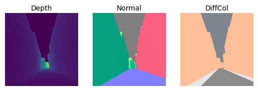

<span id="_Toc148446776" class="anchor"></span><strong>Figure 3:</strong> The 3 passes used in this project. Depth has one channel remapped from 0 to 1, Normal has 3 channels that go from -1 to 1, and DiffCol has 3 channels that go from 0 to 1.

##### Diffuse Colour

The first useful pass is the most common one. The diffuse colour pass (shortened to DiffCol in Blender) represents the base colour of each surface. 3D buildings from Open-Street map come coloured, depending on if they are a wall, a roof, a street, water, etc. A few buildings even come painted as in real-life, as the red roofs demonstrate in Figure 2. This pass plays the role of a segmentation map. It is provided to the AI as an RGB image and was not one-hot encoded due to the palette not being fixed because of the potential custom-coloured buildings.

##### Normal

There exist two versions of this pass. The first one is “Normal”: For each axis (x, y, and z), it has a value between -1 and 1 to represent how much is the face colinear with an axis. The second one is called “Denoising Normal” and it represents the normals relative to the camera. As per our context, because we are extracting 360° images that we will later be cropped in, the latest isn’t pertinent. The first one gives the face orientation to the cardinal points, which can help the AI have information on how to correctly project the texture on the face.

In both cases, the common RGB representation can be misleading because it puts out a lot of data since it clamps each X, Y, and Z channel between 0 and 1, leaving the negative side of each axis to 0.

##### Depth

The last pass used was added to give a sense of scale to the model. It has theoretically unbounded values since the value of each pixel is the distance to the object present in this pixel. However, the sky being infinitely far away, its value in the blender software is $1.0*10^{10}$, but this is replaced by 0 to keep the Depth pass significant. After that, it is normalized between 0 and 1 so it has a similar scale to the two other passes.

## Data Preprocessing and Augmentation

The training greatly benefits from data preprocessing and augmentation, as learning the mapping between high-resolution 360° images requires too much memory resources and diminishes the number of training samples. To augment the data and to provide the model with consistent samples, a series of transformations have been set up, with the main ones being:

-   Equirectangular to perspective random transformation

-   Resizing to a fixed size of 256\*256

-   Random horizontal flip transformation

All the transformations were written using Pytorch transformation syntax, which allows operation chaining.

The project also uses transformations that change the data structure, to allow for high modularity as to where the transformation happens (read more in 2.3).

### Perspective Transformation

360° images can be tricky to work with as they exist under multiple forms. The most common one is the equirectangular projection. It keeps vertical lines straight but deforms horizontal lines around the horizon (the middle horizontal line is straight as shown in Figure 4).

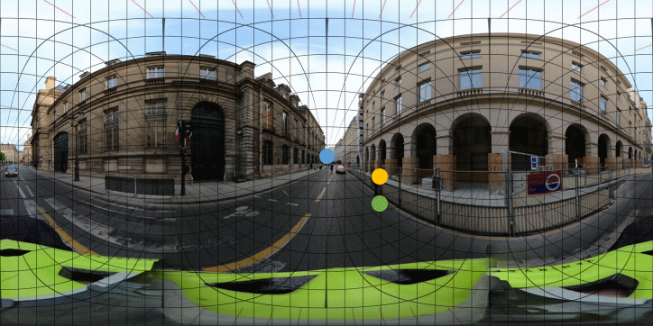

<span id="_Ref142407752" class="anchor"></span><strong>Figure 4:</strong> 360° Equirectangular image with geodesics superimposed. Image from Mapillary.

Using algorithms, it is possible to extract perspective images (the ones we are the most used to) from an equirectangular image given a yaw, pitch, roll, and field of view.

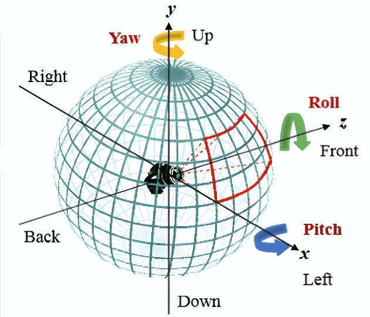

<span id="_Ref142410982" class="anchor"></span><strong>Figure 5:</strong> 360° sphere with axis corresponding to Yaw, Pitch, and Roll. From [[37]].

The algorithm used in this project was largely modified from [[38]], to allow for hardware acceleration. Nevertheless, the modified version lays down on the same principle. The idea is to create a map that indicates where to find a pixel value in the original equirectangular image given a (x, y) coordinate point in the final perspective image.

Then, we apply a method that effectively creates a new image from the equirectangular values and the pixel locations from the map. As it is a matrixial operation, it greatly benefits from being hardware-accelerated, lowering the processing time by up to 5 times[^1].

This transformation can be done without any change to multi-channel images. Because creating the correspondence map is the longest operation of the transformation, it was observed that it was faster to concatenate the 7-channel images and the 3-channel images and transform them together.

The colour points (blue, yellow, and green) displayed in Figure 4 correspond to the centre of each extracted perspective image in Figure 5.

||||
|:-------------------------------:|:-------------------------------:|:-------------------------------:|
|<br>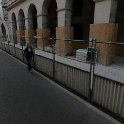|<br>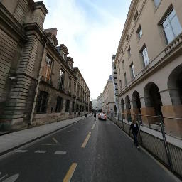|<br>|
|a)|b)|c)|

<span id="_Toc148446779" class="anchor"></span><strong>Figure 6:</strong> (a) Yaw=0°, Pitch=15° (looking up), FOV=100° (zoomed out), (b) Yaw=30° (looking right), Pitch=0°, FOV=90°, (c) Yaw=30° (looking right), Pitch=-15° (looking down), FOV=80° (zoomed in).

#### Data Corruption

For unknown reasons, this transformation can randomly corrupt samples, replacing a few of the output values with NaN (not a number). It seems to happen for a specific sample and condition, and a great dose of randomness. For instance, during a training process where a sample was found corrupted, its ID and transformation parameters were saved to explore the issue. Sadly, running a loop of the exact same transformation (with fixed parameters) and the same problematic sample gave 6 corrupted outputs on average out of 200.

On one of the function’s documentation [[39]], it is specified that if it is run on GPU, there may be some non-deterministic computation. However, the loop test was realised on CPU, and with the pytorch \` use_deterministic_algorithms\` option set to True.

This corruption did not hinder the first training tests with U-nets. However, when the decision was made to switch to the SPADE model, the first appearance of NaN in the sample corrupted the entire network with NaN, leading to empty outputs.

Because it happened only on a few samples, a deeper investigation as to why this happened was not conducted, and a retry feature was developed. This allowed each corrupted sample to be recomputed with new random parameters during the training phase. This effectively decreases the number of corrupted samples to 0, with at most 1 retry on a 10.000 iterations test.

#### Transformation Range

For the project, the perspective transformation was applied using random parameters (more on that in 2.2.5).

The yaw rotation was given its full range, with 0 meaning facing forward, hence often seeing the horizon and the road.

However, the pitch was limited to being between 0° and 60°. Indeed, looking down would too often show the transportation device the camera was on (a bike, a car, a helmet etc.). Sometimes, the bottom section was even entirely white to protect the privacy of the user, without compromising too much data. To avoid learning on these low-information spots, it was decided to only allow the transformation to look up.

Finally, the field of view was limited between 60° and 120°, to avoid having too much distortion around the edges of the image. For specific purposes, there is no reason why this parameter could not be allowed its full range, in regards to the quality limitations exposed in 2.2.2.

### Resizing

Once transformed to a perspective view, we have square images with a variable size that depends on the FOV parameter. The closer the FOV is to 180°, the bigger the perspective image. For instance, given an input 360° image of $2048 \times 1024px$, a FOV of 180° would give a $1024 \times 1024px$ image. From the same input image, a FOV of 90° would give a $512 \times 512px$ image.

Using a fixed size for every sample is necessary as it allows the creation of batches of images and is required for the convolutional layers.

The choice of resizing to $256 \times 256px$ was motivated by the fact that it was lighter computational-wise: the network can be shallower, and fewer filters in each convolutional layer are needed.

### Remapping

The values of each of the ten channels (3 for the real image, 7 for the simulated image) are remapped to \[-1; 1\] or to \[0; 1\]. The absence of normalisation is due to the fact that the simulated image contains physical information that should not have their distribution deformed. Indeed, the depth and normal passes are linked to physical properties, and normalisation would change the distribution, hence the meaning of the pass. This remapping ensures that all the pixel values are on a similar scale which can lead to quicker convergence and stable training thanks to the optimization algorithms finding the optimal weights and biases more effectively.

However, the ground truth sample could benefit from a normalisation process as it makes the model less sensitive to the absolute intensity values of the images. This is especially useful when images have different lighting conditions, exposure levels, or colour channel variations as it is the case in the different parts of the 360 images. The model becomes more focused on learning meaningful patterns rather than being distracted by variations in pixel values.

### Horizontal Flip

This common data augmentation technique makes the model less prone to overfitting. Every time a sample goes through this transformation, it has a 50% chance of being flipped.

### Random Transformation

There are multiple possibilities to augment the original dataset. It can be randomly transformed as the training goes, giving different transformed samples at each epoch, or it can be pre-transformed in a step that happens before the training phase.

The first method comes with a few advantages:

-   During the training phase, each sample generated will be unique thanks to the fact that the augmentation parameters are continuous. This will provide greater data richness to the model.

-   The image disk size is not negligible (\> 1MB per sample). This method only needs to save the original sample on the disk, as the new samples are transformed on the go.

However, it is the method of choice here mainly because the transformation process does not impact training speed so much, thanks to the numerous optimizations. When sample transformation is the longest step, it can become pertinent to pre-transform the entire dataset to save significant amounts of time.

## Computation Time and Data Loading

In the entire codebase, the longest part was reading and decoding files from the disk. In the first dataset version, each pass had its own file, with jpeg images for RGB passes, and compressed binary files for vector passes (normal and depth).

Fortunately, Pytorch - a machine learning Python library - provides quick access to multiprocessing data loaders through its 'Dataloader' class. This argument makes Python spawn new kernels with the sole goal of executing the loading task along with some transformations. Using multiple processes allows Pytorch to escape the Python Global Interpreter Lock (GIL) which blocks every other task if another one is running in the same or another thread.

### Transformation Bottleneck

The initial idea was to offload all the transformations on four (as many as there were cores on the supercomputer) son processes, with hardware acceleration enabled. As it turns out, hardware acceleration on multiprocessing is slower than running the transformations on the CPU. It probably comes from the GPU being fully solicited by the forward step and backpropagation of the model.

### Order Matters

Nevertheless, the optimization wasn’t in vain, and some transformations required careful thinking to find the right order of sequence. In the first version of the project, each new 360° sample was first transferred to the GPU memory to be transformed into a perspective view. However, transferring a 10-channel $2048*1048px$ image to GPU memory is a time-consuming process, and performing the perspective transformation on the CPU first to reduce the size of the image proved to be a move in the right direction.

Eventually, two different transformation steps were involved: one that transform a sample in the data loading step, and the other one that transform the whole batch. This last batch transformation is just to transfer the batch tensor to the computation device.

Unfortunately, the perspective transformation uses the Pytorch \`grid_sample\` method that only works on 4D vectors (batch multi-channel images). With the decision to transform samples independently, a special transformation just to temporarily add a new empty dimension to the sample was created.

### Finding the Optimal Batch Size

The generation of a sample is independent of the batch size, meaning that requesting 8 samples will be twice as long as asking for 4. We can express the total time to generate a batch as follows:

$\mathbf{t}_{\mathbf{batch\ loading}}\mathbf{=}\mathbf{t}_{\mathbf{sample\ loading}}\mathbf{*batch\_ size}$

Equation

with $t_{sample}$ being the time for one sample to be loaded.

However, it has been observed that the training process benefits greatly from being put in batches. If we run a small training process over 1 epoch and 240 samples, and that we profile the script (it is an operation of recording the time each function takes to complete); we can plot the time it took for the data loading and for the model training:

<span id="_Ref143264246" class="anchor"></span><strong>Figure 7:</strong> Time to process 240 samples against the batch size [^2], with a single process and with 4 separate data loading processes.

The figure above validates the hypothesis given in Equation 1. However, it also highlights that in a single process, when the batch size is superior to 2, the model will have to wait for new samples to be loaded. To counteract that, more processes can be used in the \`Dataloader\` Pytorch class, lowering the time the main process must wait for new samples.

This graphical method can also be used to find the minimal batch size that will minimize the overall running time. Indeed, we can see on Figure 7 that a batch size of 4 is the smallest value for which there is no waiting time with 4 data loader processes. Nevertheless, a small batch size can lead to nosier gradients when backpropagating, which can lead to a more unstable training. Nonetheless, this excess of noise can be great for the exploration diversity as more regions of the latent space are explored.

We can also see on Figure 7 that, despite 4 workers, the multiprocessing data loading takes only half as much time as the single process data loading. Unfortunately, separate processes are too hard to profile so the reason why that happens hasn’t been explored.

## Network Architecture

Multiple networks were tested throughout the project, but due to limited computational resources, all the optimizations have not been tested on all the generators.

This project started around the code source of the infraGAN project, which itself is forked from CycleGAN and pix2pix. It comes with multiple models integrated such as a ResNet generator, a U-net generator, a PatchGAN discriminator and a PixelDiscriminator that gives a pixel-level prediction. Unfortunately, as it wasn’t intended for Python developers, the infraGAN was designed to be used through a bash interface and it did not provide a usable Python API. Furthermore, given the particular data structure with 7-channel inputs, and with a specific format (compressed NumPy arrays), the infraGAN was not capable of loading the dataset.

A huge step was then to rewrite pertinent parts of the project with a suited and documented Python API.

### U-net Generator

The first model tested in this study was the U-net, which is a fully convolutional network. It can be quickly adapted with a few parameters such as the number of filters in the uppermost layer, and the number of levels.

In the pix2pix architecture that converts RGB images to RGB images, it uses 64 filters and 7 levels. Because this project is more demanding with 7-channel images, the number of filters has been increased to 128 to avoid losing too much information right from the first layer. This modification in the architecture gives the network shown in Figure 8.

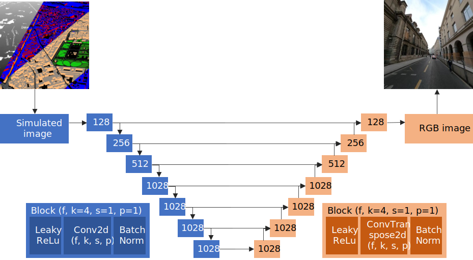

<span id="_Ref143374989" class="anchor"></span><strong>Figure 8:</strong> U-net architecture using 7-channel simulated image and translates them to photorealistic result.

#### Batch Normalisation

Because of the depth of this architecture, the model is helped by batch normalisation. It is a technique to help with the stability and convergence of the network. Batch Normalization normalizes the activations in each layer by subtracting the mean and dividing by the standard deviation of the mini-batch. By doing so, it helps to maintain activations within a reasonable range, preventing them from becoming too large or too small. This allows for a more stable gradient flow during backpropagation, leading to a faster convergence of the network's weights. It also reduces the probability of vanishing and exploding gradients, which can hurt the model’s performance.

#### Skip Connections

Skip connections too, are a tool to improve learning ability in very deep architectures. Sometimes named “residual connections”, they were popularised by ResNet in the ResBlocks. As mentioned in the Related Work section, they are particularly useful to preserve fine-grained spatial information throughout the layers. The encoder extracts high-level information, and the decoder, with the help of skip connections, refines the segmentation map while considering details from multiple scales.

### Spade Generator

The main focus of the SPADE model (developed by NVIDIA) is on generating realistic and high-quality images by effectively incorporating semantic information into the image synthesis process. Similar to the U-net architecture, SPADE also uses skip connections to connect features from earlier layers to capture both local and global contextual information.

As per the U-net, there is an access to a few parameters to control the network. The base number of filters can be modified and is equal to 64 by default, and we can also modify the up-sampling layers with 3 options: normal, more, and most giving 5, 6 or 7 up-sampling layers.

The SPADE’s code on GitHub [[40]] is under a creative-commons license and presents two *blocks* (Figure 9) that form the SPADE *model* (Figure 10).

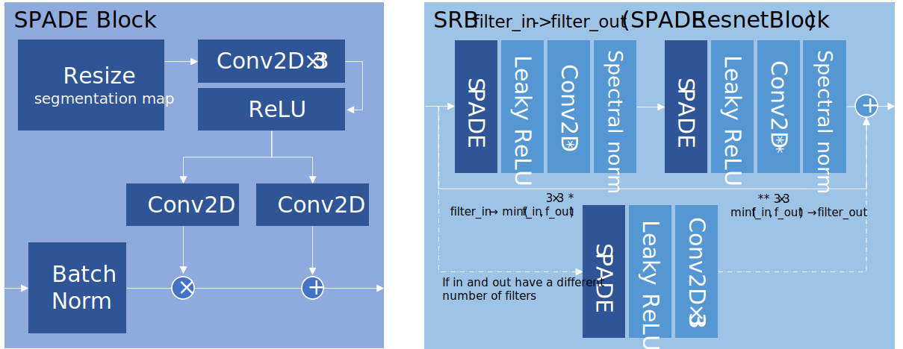

<span id="_Ref143434621" class="anchor"></span><strong>Figure 9:</strong> Architecture of SPADE block and SPADE ResNet block.

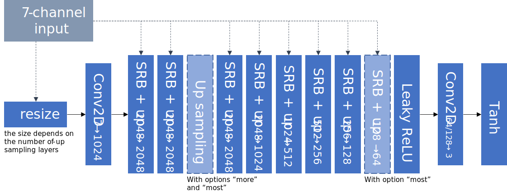

<span id="_Ref143434560" class="anchor"></span><strong>Figure 10:</strong> Architecture of SPADE generator.

In this architecture, we see the large use of the input segmentation map at every stage of the network. Due to its numerous layers, this generator network is 6 times longer to train than its U-net counterpart.

### PatchGAN Discriminator

The PatchGAN is a small fully convolutional network that aims at identifying generated samples among the ground truth samples. As Isola P. et al [[22]] state, “This discriminator tries to classify if each N × N patch in an image is real or fake”. This discriminator is run convolutionally across each image of the batch, giving a non-binary output that is the average of all the predictions. Its architecture is given below.


<span id="_Toc148446784" class="anchor"></span><strong>Figure 11:</strong> Architecture of the PatchGAN discriminator, with 256×256 inputs.

The pix2pixHD paper [[41]] identified this discriminator architecture as responsible for patterns in the generated image due to its patch predictions. They propose a multi-scale discriminator, where three identical models discriminate the given input at a different scale, by resizing the input. Given the relatively small images in this project ($256*256px$), it was decided not to test it.

### Cycle GAN

In the first version of the simulated to street-view dataset, simulated images were not well aligned with street views. This situation made CycleGAN the premium choice for the development of the model. It can accommodate any generator/discriminator combination, but the default ones were used. The basic idea is to have two pairs of generators and discriminators, each dedicated to translating one domain to another.

We had:

-   *G_Sim2Streetview*: translates 7-channel simulated images to 3-channel street-views.

-   *G_Streetview2Sim*: translates street-views to simulated image.

-   *D_Sim*: Distinguishes simulated images from the dataset and simulated images generated by G\_*Streetview2Sim*.

-   *D_Streetview*: Distinguishes street-views from the dataset and streetviews generated by *G_Sim2Streetview*.

The key benefit of CycleGAN is the introduction of cycle consistency loss. This loss ensures that if you translate an image from domain A to domain B and then back from domain B to domain A, you should end up with an image that is similar to the original. This cycle consistency enforces a form of self-consistency in the translated images. The training process still uses the adversarial loss, which makes the generator compete with the discriminator.

## Evaluation

### Loss Functions

#### Adversarial Loss

The adversarial loss term, often referred to as the "GAN loss", is a key component of GANs. It is used to train the generator to produce realistic and convincing outputs that are indistinguishable from real data. The adversarial loss is calculated based on the difference between the discriminator's predictions for real street-views and the generator's generated street-views. It essentially quantifies how well the generator is fooling the discriminator.

-   Generator's Objective: The goal of the generator *G_Sim2Streetview* is to produce street-views that are so realistic that the discriminator *D_Streetview* cannot distinguish them from real images in domain B. In other words, *G_Sim2Streetview* tries to generate images that "fool" *D_Streetview* into thinking they are real.

-   Discriminator's Objective: The discriminator *D_Streetview*, on the other hand, tries to correctly classify images as either street-views or simulated.

Mathematically, the adversarial loss can be defined as the binary cross-entropy loss between the discriminator's predictions and the true labels (real or fake) for the generated images.

As in [[27]] [[22]] [[23]], the adversarial loss term is the binary-cross-entropy combined with a sigmoid layer, it is called “BCEWithLogitsLoss”. It takes the raw output, called logits (so the output before the activation function if there is one), of the discriminator and applies the BCEWithLogitsLoss with a computation trick that is more numerically stable than applying the sigmoid activation and then uses a separate binary cross-entropy loss function. Its expression for one sample of a batch, with x as the input and y as the target, is the following:

$$\mathcal{l(}x,\ y) = y \cdot \log\sigma(x) + (1 - y) \cdot log\left( 1 - \sigma(x) \right)$$

To compute the batch loss, the average if $\mathcal{l}$ over each sample is taken.

#### Generator Loss

This loss measures how close to the truth street view the prediction is. L1 loss measures the mean absolute error for each element in x and y. It is expressed for a single sample as:

$$\mathcal{l(}x,\ y) = |x - y|$$

When computed for a batch, it is reduced with $mean$ as for the adversarial loss.

L1 loss encourages the generated images to be closer to the ground truth images in terms of pixel intensity values. This tends to preserve fine details and textures in the generated images, resulting in sharper and more realistic outputs. [[22]] demonstrated that the L1 loss penalizes larger deviations between the generated and target images linearly, compared to the quadratic penalty imposed by the L2 loss (mean squared error). This characteristic helps in preventing the blurring effect that can occur with L2 loss, where slight errors in pixel values are magnified in the loss calculation.

### Segmentation Model

This work is aimed to facilitate the creation of new training data for future AI work. For this use case, it can be interesting to create custom metrics to compare the output of pre-trained models when fed the real street views and the simulated ones. One suitable example is running a segmentation model and comparing the results using the mIoU loss. This loss computes the average IoU (intersection over union) of the ground truth and the prediction for each class of the segmentation.

### Human Visualisation

Another possible evaluation is the human evaluation, often crowdsourced as in [[40]] on online platforms. Users are presented with multiple images and are asked to choose which one they prefer. Because predictions present artefacts, it is employed to compare the results compared to other AI models.

## Training

All the parameters relative to an experiment are saved inside a YAML file. It is a markup language to quickly write data files in a comprehensive way. As illustrated in Figure 12, there are 3 main blocks in the YAML files of this project: network, train, and data.

```yaml
network:
  generator:
    n_levels: 8
    n_filters: 128
    lr: 1e-4
  discriminator:
    n_layers: 3
    n_filters: 64
    lr: 1e-4
train:
  in_data: data/
  out_data: data/unet_first_test
  n_epochs: 1000
  batch_size: 20
  dataset_split: \[0.8, 0.2, 5\]
  checkpointer:
…
```

<span id="_Ref143496302" class="anchor"></span><strong>Figure 12:</strong> Data found inside the YAML file.

The file is loaded when the \`train.py\` script is run, and it does not replace the Python interface, i.e., all the Python functions’ arguments are explicit and not hidden behind an \`opt\` dictionary, as we often find in open-source code bases.

### Data Splitting

The splitting of the dataset in train, validation and visualization is done with the \`train.dataset_split\` option. A special function was written to allow the mixed use of fractions and integers. It starts by attributing each integer a proportion of the full dataset, then it scales down the other fractions accordingly. Furthermore, the sum of fractions can be lower than one (but not superior to one), and the function will automatically discard the unused part of the dataset.

### Optimizers

During each iteration of the training process, the goal of the optimizer is to update these parameters based on the gradients of the loss function with respect to the parameters. The gradients indicate the direction and magnitude of change needed to reduce the error.

The generators and the discriminator in this work all use the Adam (for Adaptive Moment Estimation) optimizer. It uses the first and second moment for each model parameter. The moving averages m (for mean) and v (for variance) are updated using exponential moving averages of the current gradients and their squared values, respectively. These updates are controlled by two hyperparameters: beta1 (controls the decay rate for the moving average of the gradients) and beta2 (controls the decay rate for the moving average of the squared gradients). With $g_{t}$ the current gradient, we have the following equations for m and v:

$$m_{t} = \beta_{1}*m_{t - 1} + \left( 1 - \beta_{1} \right)*g_{t}$$

$$v_{t} = \beta_{2}*v_{t - 1} + \left( 1 - \beta_{2} \right)*{g_{t}}^{2}$$

The spade network uses $\beta_{1} = 0.0$, reducing the first moment to $m_{t} = g_{t}$, and $\beta_{2} = 0.999$, its default value in [[42]]. The discriminator uses default values described in [[42]] for both beta arguments.

### Metrics

To evaluate the model, metrics are evaluated for each batch of the training and the validation. It uses a custom \`MetricLogger\` object that takes advantage of the ignite (a library developed alongside Pytorch) metrics.

Each loss term of each model is saved to allow for retro-analysis, and a few others are also computed, such as SSIM, short for Structural Similarity Index Measure. It takes into account three main components of image quality:

-   Luminance. It measures the similarity of the luminance (brightness) values between corresponding pixels in the two images.

-   Contrast. It evaluates how well the contrast in the two images matches. It considers the local variations in contrast and aims to capture the relationship between pixel intensities.

-   Structure. It assesses the structural similarity between the images by considering the correlations between neighbouring pixels. It reflects the spatial arrangement of features in the images.

The SSIM index ranges between -1 and 1, where a value closer to 1 indicates higher similarity between the images, and a value closer to -1 indicates greater dissimilarity. A value of 0 implies that the images are uncorrelated.

### Mixed Precision Training

Mixed precision training is a technique used in deep learning to speed up training and reduce memory usage by using a combination of different numerical precisions for calculations during the training process. The Pytorch documentation [[43]] states that “\[float32 precision\] is a historic artefact not representative of training most modern deep learning networks. Networks rarely need this much numerical accuracy”.

The main idea behind mixed precision training is to use lower precision (e.g., 16-bit floating-point) for certain parts of the network while keeping higher precision (e.g., 32-bit floating-point) for other parts. In most cases, the weights of the neural network can be stored and updated with lower precision without significantly impacting the overall performance of the model. However, using lower precision for activations and gradients during backpropagation can introduce numerical instability due to reduced precision's limited dynamic range.

Two half-precision formats exist: float16 that uses 1 sign, 5 exponent, and 10 significand bits; and bfloat16 (for brain floating points) that uses 1 sign, 8 exponent and 7 significand bits. The latter can achieve broader ranges thanks to having the same number of exponent bits as the float32 type.

#### Adapt Functions to Support New Types

Unfortunately, not any training networks or metrics are suited to use 16-bit precision. This can lead to a cumbersome task of finding alternative computation methods, or to develop new features dedicated to half-precision training.

For this project, the Structural-Similarity index measure (SSIM) from the ignite open-source library developed by Meta alongside Pytorch, was greatly improved.

First and foremost, the bug preventing the use of torch.float16 or torch.bfloat16 was resolved through a GitHub pull request [[44]]. This pull-request also contains multiple analyses to compare the accuracy between half-precision formats and float32:

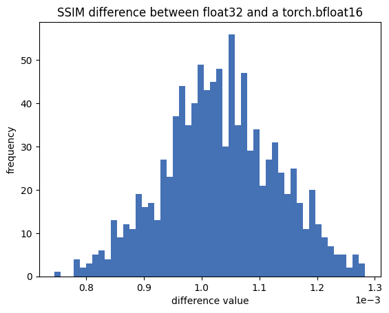
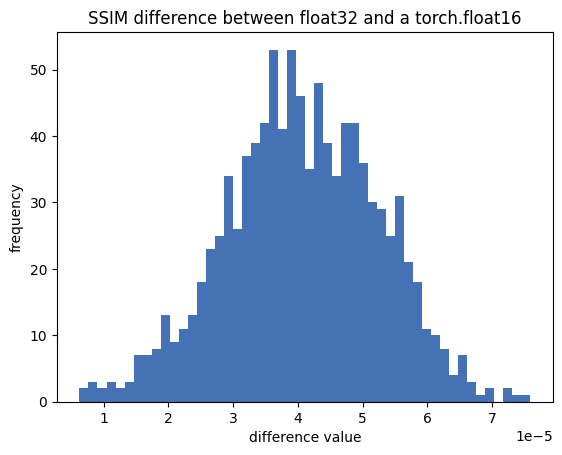

<span id="_Toc148446786" class="anchor"></span><strong>Figure 13:</strong> precision of bfloat16 (left) and float16(right) against float32 when computing the SSIM metric.

Three other pull requests focused on SSIM performance ( [[45]] [[46]] [[47]]) were also merged. They included unit testing which automatically verifies that the code works as intended. Finally, a last improvement is on the making to make the SSIM compatible with unsigned 8-bit integers, sometimes used in neural networks with images.

### Model Saving

The model weights of the generator and discriminator are automatically saved each 20 epochs. The saved weights do not include the optimizers, nor other parameters making a training continuation harder to do.

### Visualisation

At each epoch, visualisation samples are also plotted. The samples were picked in the dataset initialisation phase and were not on the train dataset nor in the validation dataset. The plot consists of the predicted image, discrimination map, and target image. To enable comparison between epochs, they had a fixed transformation to avoid changing the perspective view parameters.

During the initialisation phase, the simulated image is also plotted, showing side by side all the different passes, as depicted in Figure 14.

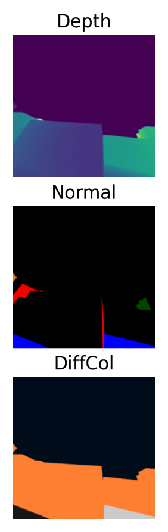
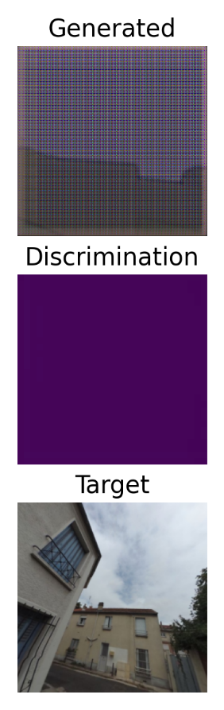

<span id="_Ref143499370" class="anchor"></span><strong>Figure 14:</strong> First visualisation sample on the first iteration of the U-net generator training. The simulated sample is only generated once in a separate file to avoid redundancy. The perspective transformation was done using yaw=0°, pitch=30°, w_fov=100°.

## Ethics

The ethics regarding the usage and the data source of this project have been considered. The street-view images undergo a preprocess blurring every person, license plate or sensible information.

This project was audited by the Cranfield University Research Ethics System (CURES), and their letter of approval can be seen in 6Appendix A.

## Gantt Chart

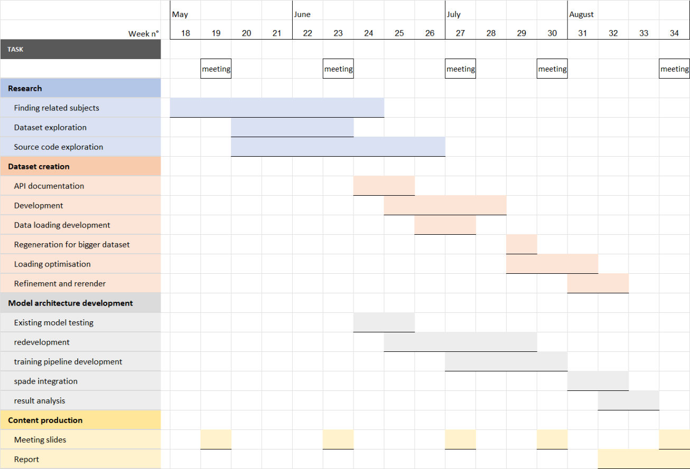

<span id="_Toc148446788" class="anchor"></span><strong>Figure 15:</strong> Gantt chart, in weeks.

The work was organised as shown above. The thesis subject was validated on the second meeting in June which led to a short period of development work. There was an optimization process with a profiler (as discussed earlier) in every development task of the Gantt project.

# Results and Analysis

The tests were all run on a single V100 NVIDIA GPU, along with 1 to 4 Xeon processors with 32GB of RAM in total. Each run is limited to 120 hours, limiting the training to 5 days.

## Training Issues

Numerous tests were conducted with the different architectures exposed in the methodology section. Unfortunately, they were not conclusive because the generator had struggles to learn.

### With a U-net Generator

|input|epoch 1|epoch 20|epoch 100|epoch 136|
|:-------------------------------:|:-------------------------------:|:-------------------------------:|:-------------------------------:|:-------------------------------:|
|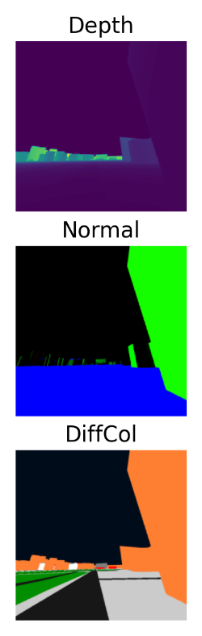|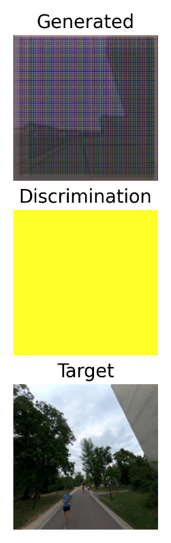|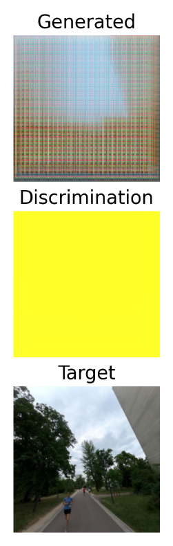|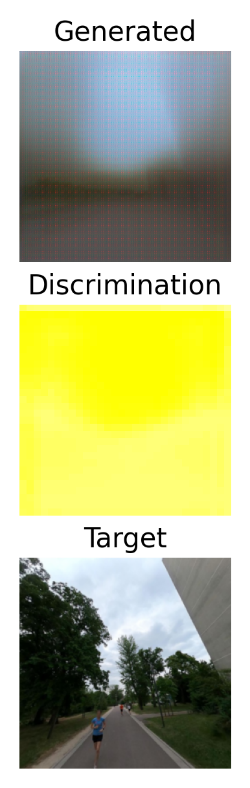|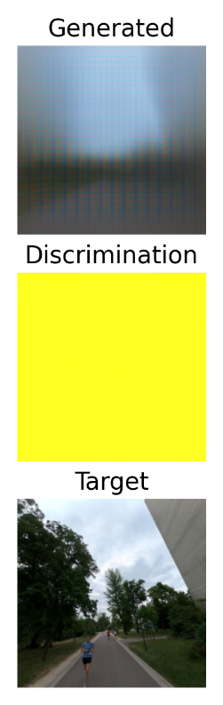|

<span id="_Ref143528024" class="anchor"></span><strong>Figure 16:</strong> Evolution of the predictions throughout the training process. From left to right: simulated image, epoch 0, epoch 20, epoch 100, epoch 136.

Figure 16 shows that throughout the epochs, the generated sample went in the right direction, with the sky slowly appearing and the blockiness fading away. The road became more refined, and the sky took a bluer tint. The discriminator was almost consistently predicting the image as real.

|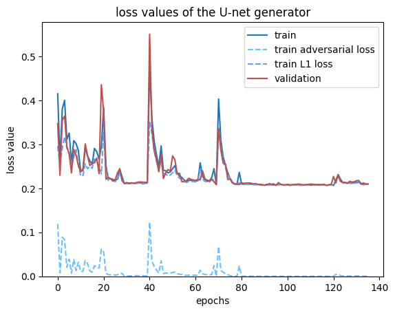|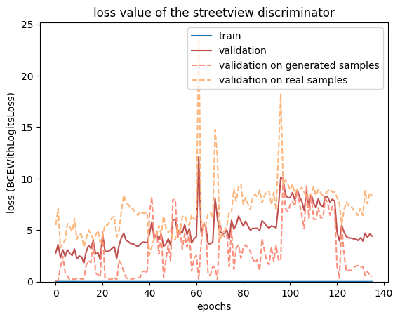|
|:-------------------------------:|:-------------------------------:|
|a)|b)|

<span id="_Ref143508388" class="anchor"></span><strong>Figure 17:</strong> Loss values for the U-net generator and discriminator.

In figure 17 a), we can see that, indeed, the generator successfully fools the discriminator into thinking that the generated street views were true. Unfortunately, the same plateau as in the previous test for the L1 loss appears again but wasn’t synonymous with stagnation in the perceived quality. Figure 17 b) also suggests that the discriminator is easily fooled and that it is even more likely of being wrong when presented with real street-views.

### Using the SPADE Generator

The switch to the more recent and adapted SPADE generator was made with huge hopes, that were quickly dismissed by the only slightly better results. This test showed that eventually, the discriminator was able to “fight back” after the 60^th^ epoch as shown in Figure 19, but the L1 loss was starting to increase in parallel, despite being more stable.

|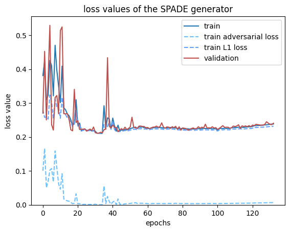|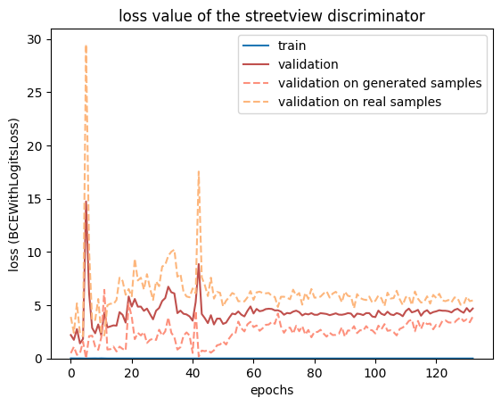|
|:-------------------------------:|:-------------------------------:|
|a)|b)|

<span id="_Ref143510833" class="anchor"></span><strong>Figure 19:</strong> Loss values for the SPADE generator and for the discriminator.

The sample depicted in Figure 20 between the 50^th^ epoch and the 138^th^ does not show any improvement, on the contrary. A lot of artefacts became visible, especially with the vertical lines of colours. However, the perceived quality of the SPADE generator is higher (Figure 20) than with the U-net thanks to its smoother look and faster convergence towards true colours.

|epoch 1|epoch 10|epoch 50|epoch 138|
|:-------------------------------:|:-------------------------------:|:-------------------------------:|:-------------------------------:|
|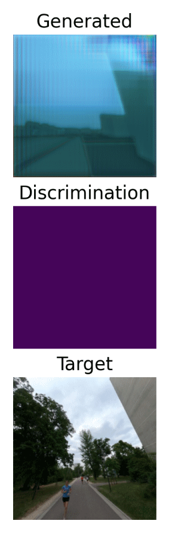|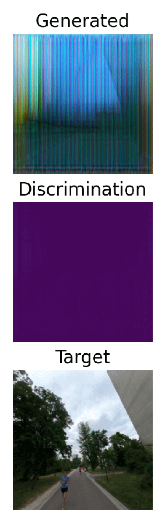|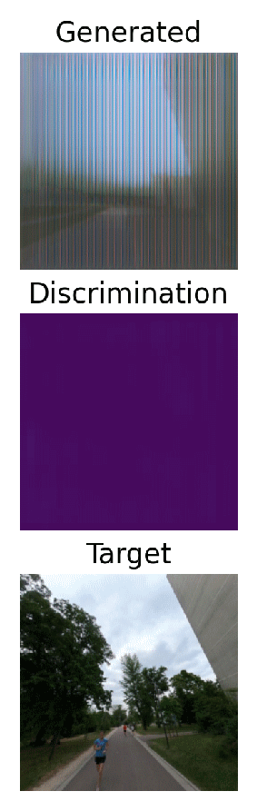|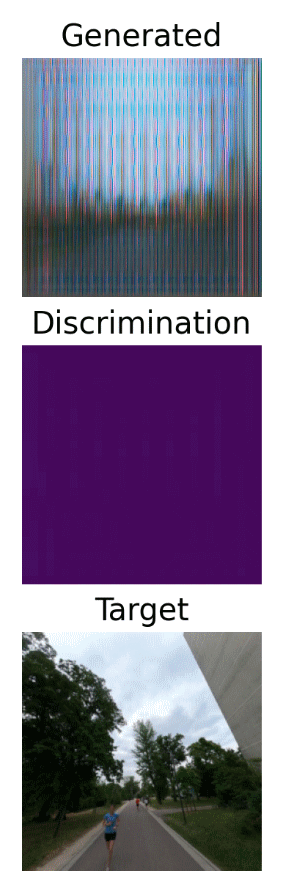|

<span id="_Ref143510875" class="anchor"></span><strong>Figure 20:</strong> Visualisation of generated samples for epoch 1, 10, 50, 138 for the SPADE generator.

## Successful Tests

Eventually, this discriminator was identified as a serious bottleneck for the training of the models. Its code architecture was revamped and rewritten from the ground up.

### The Working SPADE Generator

The first test that was rerun was with the SPADE generator. It lasted for five days (the maximum length) on one GPU and did 330 epochs. The batch size was 2, determined with the graphical method described in 2.3.3. For context, the model trained in the work of T. Park et. al [[48]] saw four million images in batches of size 32.

|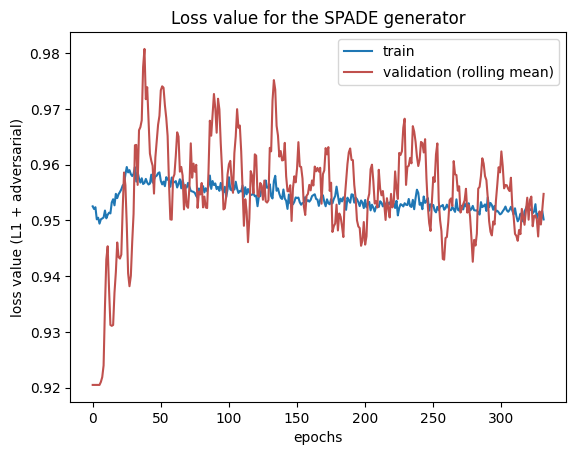|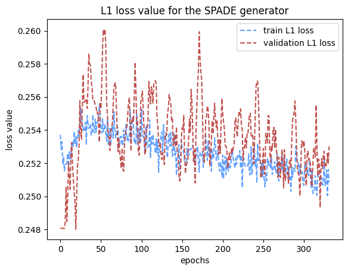|
|:-------------------------------:|:-------------------------------:|
|a)|b)|

<span id="_Toc148446794" class="anchor"></span><strong>Figure 21:</strong> Loss values for the SPADE generator in working conditions.

The graphs presented in **Figure 21** are much more encouraging. They both show a steady decrease in the train and validation loss. When plotted separately (for the sake of scale), the L1 loss is revealed to be decreasing too, indicating that the generators can indeed get closer to the target.

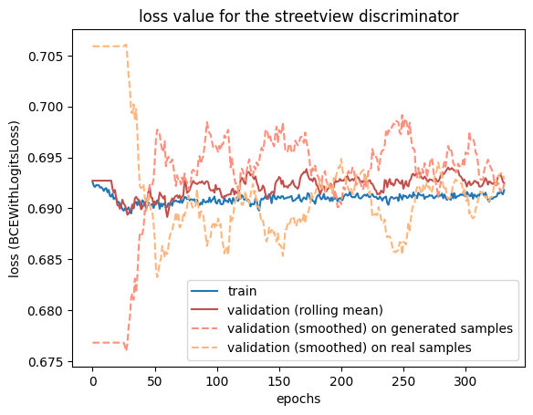

<span id="_Ref144146108" class="anchor"></span><strong>Figure 22:</strong> Loss value of the discriminator in working conditions.

However, Figure 22 reveals that the discriminator was not necessarily up to the task as it is being fooled more and more as epochs go by. The two dotted lines point out that it struggles particularly with generated samples and tends to have a better prediction regarding real samples. The generated samples being too realistic for the discriminator to distinguish, it may benefit from a slightly higher learning rate.

Indeed, when assessed by humans, the generator is much better than what the curves may show through. On **Figure 23**, we can see that the last two samples are quite realistic, despite being far from the target. We can also notice that they differ a bit in the style of the buildings. As the model is right now, there is no possibility to steer the generated style towards the style of a given image. It is possible to adapt the SPADE generator to also use a style vector alongside the input. That would allow the user to ask for a Haussmann style, or Victorian style, by just providing an image with such buildings on it. The style vector can also be used to obtain results at dawn, or during winter.

|epoch 1|epoch 20|epoch 100|epoch 330|epoch 331|
|:-------------------------------:|:-------------------------------:|:-------------------------------:|:-------------------------------:|:-------------------------------:|
|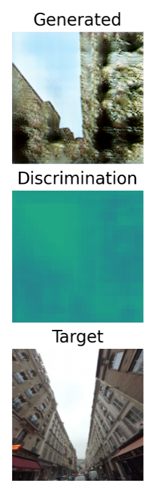|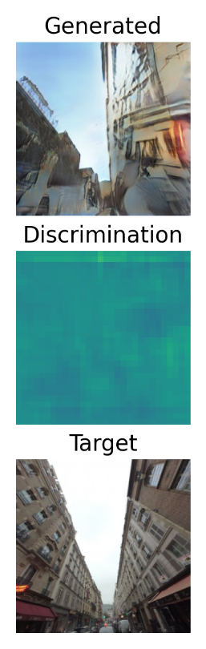|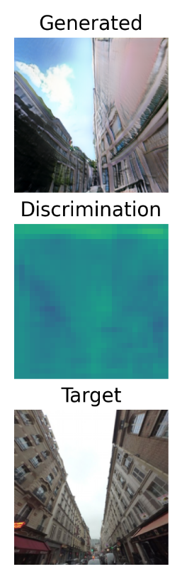|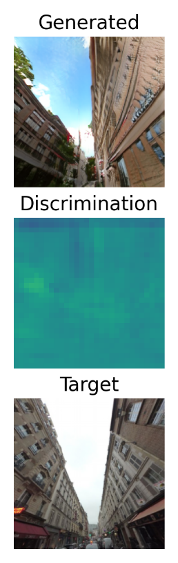|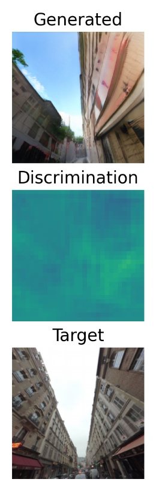|

<span id="_Toc148446796" class="anchor"></span><strong>Figure 23:</strong> Generated samples with the working SPADE generator, for epochs 1, 20, 100, 330 and 331.

## Comparison against other models

This well working SPADE generator was compared with other existing models, with both metric evaluations, and human evaluation. The competing models are a CycleGAN with its two spade generators having a lower base filter number to fit in memory; a 7-level deep U-net, and finally, the same SPADE generator but optimized with hinge loss. All generated samples can be seen in Appendix B.

If the scores presented in **Table 1** put the CycleGAN last, the visual inspection of **Figure 24** clearly shows that the CycleGAN outputs a refined representation of the building on the left, but totally miss out the building on the right. It could be an issue with surface normal, as it is the pass that indicates an orientation and can have negative values. On the other hand, the SPADE that uses the hinge loss fails to achieve realistic outputs, but did capture the sky, along with greenery.

<span><strong>Table 1:</strong> SSIM scores for tested models' generators.

| **SPAPE + L1 loss** | **CycleGAN + L1 loss** | **U-net + L1 loss** | **SPADE + hinge loss** |
|------------------|------------------|------------------|------------------|
| 0.2860              | 0.8327                 | 0.3584              | 0.3208                 |

| **SPAPE + L1 loss** | **CycleGAN + L1 loss** | **U-net + L1 loss** | **SPADE + hinge loss** |
|:-------------------------------:|:-------------------------------:|:-------------------------------:|:-------------------------------:|
|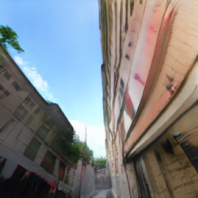|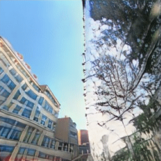|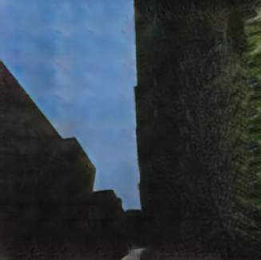|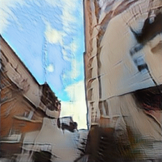|
|a)|b)|c)|d)|

<span id="_Ref147434316" class="anchor"></span><strong>Figure 24:</strong> Last generated samples for the (a) SPADE with L1 loss network, (b) the CycleGAN network, (c) the U-net network, and (d) the SPADE with hinge loss network.

For all the models, the generator was left untouched. However, the differences in its performance between the variations are notable. The weaker discriminator that focuses on distinguishing real street views from the fake ones is once again the CycleGAN. However, the contrast in the SPADE + hinge loss’s discriminator prediction is particularly impressive, leading to think that the discriminator was not challenged enough but the generator. On **Figure 25** (b), (c), (d), we can distinguish the sky taking a special place in the prediction.

<span><strong>Table 2:</strong> Binary cross entropy scores for tested models’ discriminators.

| **SPAPE + L1 loss** | **CycleGAN + L1 loss** | **U-net + L1 loss** | **SPADE + hinge loss** |
|------------------|------------------|------------------|------------------|
| 0.6952              | 0.7159                 | 0.5185              | 0.5045                 |

| **SPAPE + L1 loss** | **CycleGAN + L1 loss** | **U-net + L1 loss** | **SPADE + hinge loss** |
|:-------------------------------:|:-------------------------------:|:-------------------------------:|:-------------------------------:|
|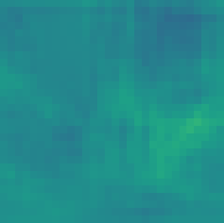|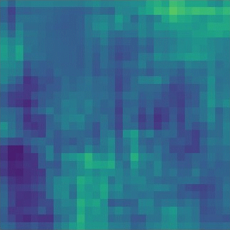|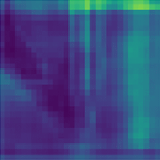|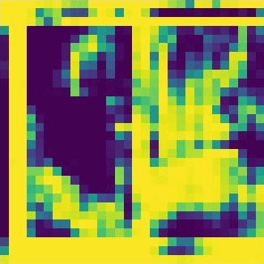|
|a)|b)|c)|d)|

<span id="_Ref147435245" class="anchor"></span><strong>Figure 25:</strong> Last generated discrimination for the (a) SPADE with L1 loss network, (b) the CycleGAN network, (c) the U-net network, and (d) the SPADE with hinge loss network.

## Ablated Model

Ablation is a technique used to study the behaviour and contributions of different components or features. Due to time constraints, only one ablation was tested. Training has been done by feeding the SPADE generator only the “*DiffCol”* pass, which is supposed to represent a segmentation map. To accommodate the important decrease in input data, from 7 channels to just 3, the number of base filters has been reduced to 64. However, the number of up-sampling layers was kept the same. This ablated model was trained on 265 epochs, with a batch size of 1.

The losses of the generator and the discriminator of this ablated model drawn on Figure 26 seem to tell two different stories. On the one hand the adversarial loss (on the left) - which measures how well the generator can fool the discriminator, or in other words how well can the discriminator notice the given output is fake - increases, particularly after epoch 125. On the other hand, the discriminator validation loss on generated samples increases a lot after the 125^th^ epoch, suggesting that the discriminator is not able to flag a generated sample as such.

|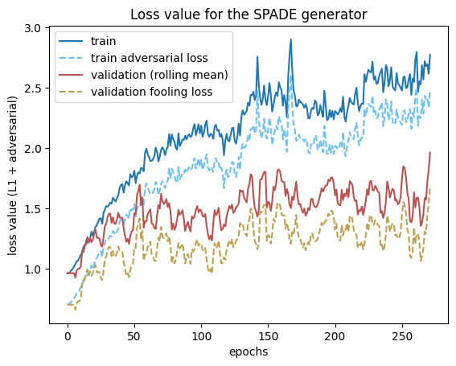|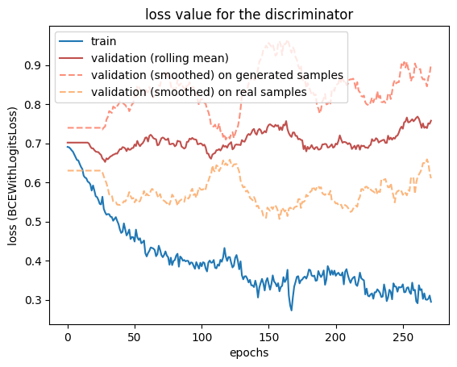|
|:-------------------------------:|:-------------------------------:|
|a)|b)|

<span id="_Ref144210795" class="anchor"></span><strong>Figure 25:</strong> Loss values for the ablated generator and discriminator.

The generated samples are not at all realistic and are presented below. No particular signs of change have been perceived around the epoch 125.

|epoch 1|epoch 20|epoch 100|epoch 265|
|:-------------------------------:|:-------------------------------:|:-------------------------------:|:-------------------------------:|
|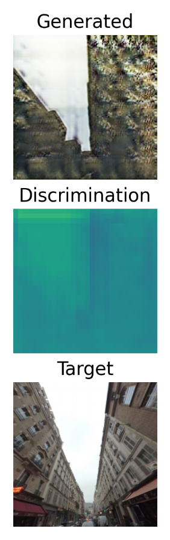|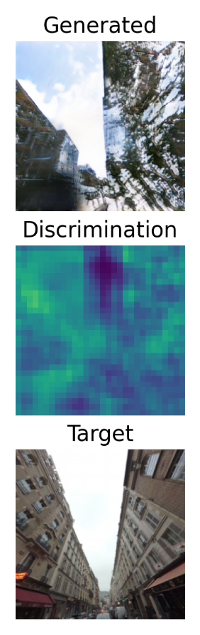|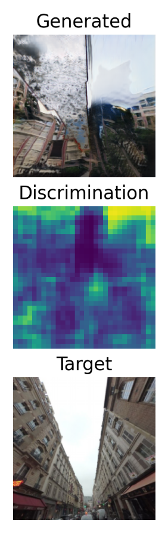|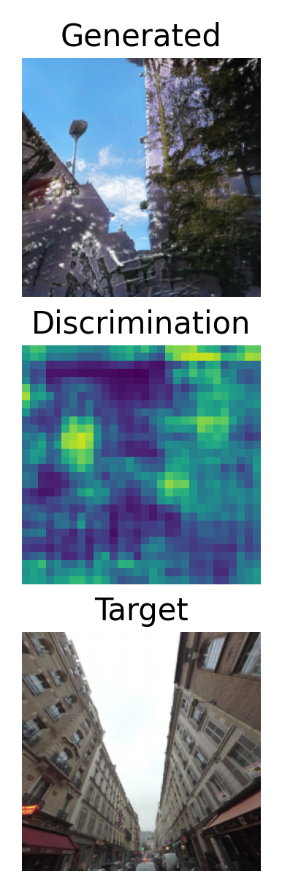|

<span id="_Toc148446800" class="anchor"></span><strong>Figure 26:</strong> Generated samples with the ablated model for epoch 1, 20, 100 and 265

## Discussion

### An Evaluated Dataset

The latest version of the dataset includes 3D camera rotation to better match the street views. However, misalignments still happen and can be particularly important when the camera is close to buildings due to the parallax effect.

The lack of metrics on the dataset makes the sample’s quality evaluation complicated. A metric could only rely on the DiffCol pass that gives enough context to explain how well a simulated sample is aligned with its matching street-views Due to the inherent characteristics’ variations between the two, real street-views may benefit from a preprocess to smooth out plane surfaces and highlight the edges, as they contain the most information about alignment. This quality evaluation could be used to discard the worst samples to improve the overall dataset quality.

### Better 3D Source

In the 3D model of Paris used to generate the simulated images, a few buildings were missing, as shown in Figure 28. A new 3D data source could improve the generation of samples by having better fitting simulated samples, and maybe even with more details such as the 3D roof’s shape, as in Google Earth.

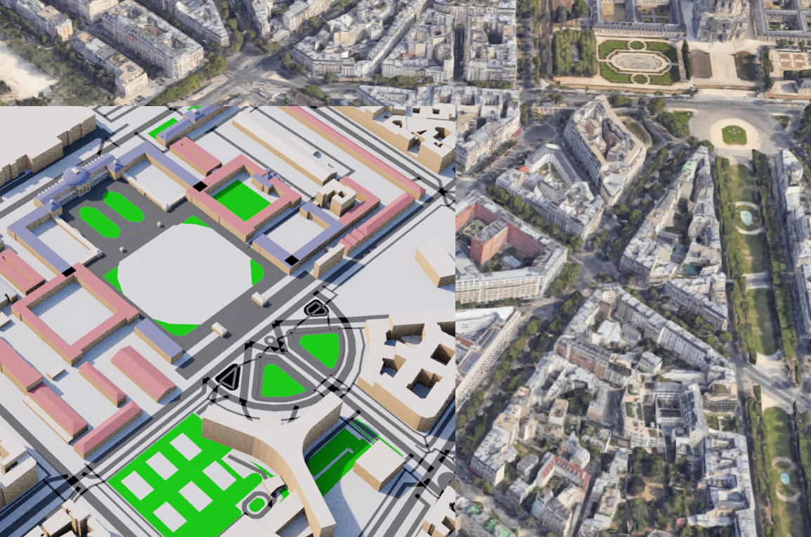

<span id="_Ref144213172" class="anchor"></span><strong>Figure 27:</strong> Patchwork of the simulated view onto the real view from Google Earth.

### More Tests

Finally, most of the tests revealed that the discriminator was often either too soft compared to the generator, or too strong. More tests and fiddling could allow for a better-suited discriminator for each generator. A technique sometimes used in conditional GAN projects is to train the generator only half the time or to train the discriminator twice on the same sample (which is different from increasing the learning rate, as the gradient direction would change between the first and second training pass).

# Conclusion

The journey with this simulated-to-streetviews domain transfer GAN has been marked by its ambitious objectives and technical challenges that complicated its success.

The creation of a custom dataset was a huge task on its own, and the dataset saw a lot of improvements with the project moving forward. In its latest version, it limits the virtual camera misalignment by incorporating a 3D rotation, and the simulated files are saved in binary format to conserve as much information as possible, going further than the traditional 8 bits per channel in RGB pictures.

This GAN was designed with the intention of enabling the effortless generation of quality and realistic images of street views. The results obtained with the SPADE generator are quite promising in this sense, and the strategy of using additional information compared to just a segmentation map proved to be the right one.

Despite the good results, multiple solutions to improve the model stability and to produce style-oriented results were proposed. These solutions could allow the model to produce non-human-discernible generated samples and thus be used as a new data source by itself.

The code is open-source and under a creative commons license, inherited from the SPADE project. It can be viewed on GitHub [[49]].

# Future Work

The dataset generation method is robust and was tested only on Paris. To extend the dataset and add diversity to the samples, other cities around the globe could be considered. Blender, the 3D software, come with a rich API that allows users to run it on supercomputers with a bash interface. That means that generating new samples could be way faster than using a single computer. This bigger dataset would still need to be scrapped from its least-matching samples, but it is a job that can be parallelised.

New geo-datasets could be used to put more features in the simulated scenes. Only the biggest infrastructure is represented in OSM, but it exists trees datasets such as the ones used at Google’s [[50]] that could increase the accuracy of the model, as trees often represent a major part of the samples.

In the current version, the user only has control over the sample it gives to the generator. An encoder could be used in parallel of this model to guide the image generation process and customize the output according to the user’s preferences such as night, winter, modern buildings, etc.

This model could also be fine-tuned to more specific applications, where the accent is put on the environment with trees, benches etc. This would make a great use case for urban planning.

Finally, to improve speed without compromising on accuracy, the model could be trained with half precision or converted a posteriori. It appeared that the SPADE was producing corrupted outputs in its early layers, with brain float or float16. However, the speed gain can be much greater than a factor of 2.

# References

|||
|------|------------------------------------------------------------------|
| [[1]]  | mapillary, “mapillary,” \[Online\]. Available: https://www.mapillary.com/.|
| [[2]]  | blender.org, “Blender.org - Home of the blender project - Free and Open Source 3D creation software,” blender organization, \[Online\]. Available: https://www.blender.org/.|
| [[3]]  | J. Long, E. Shelhamer and T. Darrell, “Fully Convolutional Networks for Semantic Segmentation,” *CoRR,* 2015.|
| [[4]]  | R. Chandra, S. Grover, K. Lee, M. Meshry and A. Taha, “Texture Synthesis with Recurrent Variational Auto-Encoder,” *CoRR,* 2017.|
| [[5]]  | D. P. Kingma and M. Welling, “Auto-Encoding Variational Bayes,” *arXiv Machine Learning,* 2022.|
| [[6]]  | a\. J. Goodfellow, J. Pouget-Abadie, M. Mirza, B. Xu, D. Warde-Farley, S. Ozair, A. Courville and Y. Bengio, *Generative Adversarial Networks,* 2014.|
| [[7]]  | X. Pan, A. Tewari, T. Leimkühler, L. Liu, A. Meka and C. Theobalt, “Drag Your GAN: Interactive Point-based Manipulation on the Generative Image Manifold,” in *SIGGRAPH 2023 Conference Proceedings*, Los Angeles, 2023.|
| [[8]]  | S. Cheng, L. Wang, M. Zhang, C. Zeng and Y. Meng, “SUGAN: A Stable U-Net Based Generative Adversarial Network,” *Sensors,* vol. 23, no. 1424-8220, p. 7338, 16 August 2023.|
| [[9]]  | J. Jeong, M. Kwon and Y. Uh, “Training-free Style Transfer Emerges from h-space in Diffusion models,” 27 March 2023. \[Online\]. Available: https://arxiv.org/abs/2303.15403.|
| [[10]] | Z. Wang, L. Zhao and W. Xing, “StyleDiffusion: Controllable Disentangled Style Transfer via Diffusion Models,” 15 August 2023. \[Online\]. Available: https://arxiv.org/abs/2308.07863.|
| [[11]] | M. Mirza and S. Osindero, “Conditional Generative Adversarial Nets,” *CoRR,* 2014.|
| [[12]] | H. Dong, S. Yu, C. Wu and Y. Guo, “Semantic Image Synthesis via Adversarial Learning,” *CoRR,* 2017.|
| [[13]] | C. Ledig, L. Theis, F. Husza, J. Caballero, A. Cunningham, A. Acosta, A. Aitken, A. Tejani, J. Totz, Z. Wang and W. Shi, “Photo-Realistic Single Image Super-Resolution Using a Generative Adversarial Network,” in *2017 IEEE Conference on Computer Vision and Pattern Recognition (CVPR)*, Los Alamitos, CA, USA, 2017. |
| [[14]] | X. Wang and A. Gupta, “Generative Image Modeling using Style and Structure Adversarial Networks,” *CoRR,* vol. abs/1603.05631, 2016.|
| [[15]] | Y. Song, C. Yang, Z. Lin, H. Li, Q. Huang and C. J. Kuo, “Image Inpainting using Multi-Scale Feature Image Translation,” *CoRR,* vol. abs/1711.08590, 2017.|
| [[16]] | Y. A. Mejjati, C. Richardt, J. Tompkin, D. Cosker and K. I. Kim, “Unsupervised Attention-guided Image to Image Translation,” *CoRR,* vol. abs/1806.02311, 2018.|
| [[17]] | R. Li, W. Cao, Q. Jiao, S. Wu and H.-S. Wong, “Simplified unsupervised image translation for semantic segmentation adaptation,” *Pattern Recognition,* vol. 105, no. 0031-3203, p. 107343, 2020.|
| [[18]] | X. Guo, Z. Wang, Q. Yang, W. Lv, X. Liu, Q. Wu and J. Huang, “GAN-Based virtual-to-real image translation for urban scene semantic segmentation,” *Neurocomputing,* vol. 394, no. 0925-2312, pp. 127-135, 2020.|
| [[19]] | D. Pathak, P. Krahenbuhl, J. Donahue, T. Darrell and A. A. Efros, “Context Encoders: Feature Learning by Inpainting,” *CoRR,* vol. abs/1604.07379, 2016.|
| [[20]] | M. Tomei, M. Cornia, L. Baraldi and R. Cucchiara, “Art2Real: Unfolding the Reality of Artworks via Semantically-Aware Image-to-Image Translation,” *CoRR,* vol. abs/1811.10666, 2018.|
| [[21]] | Z. Yi, H. Zhang, P. Tan and M. Gong, “DualGAN: Unsupervised Dual Learning for Image-to-Image Translation,” *CoRR,* vol. abs/1704.02510, 2017.|
| [[22]] | P. Isola, J.-Y. Zhu, T. Zhou and A. A. Efros, “Image-to-Image Translation with Conditional Adversarial Networks,” 21 November 2016. \[Online\]. Available: https://arxiv.org/abs/1611.07004.|
| [[23]] | J.-Y. Zhu, T. Park, P. Isola and A. A. Efros, “Unpaired Image-to-Image Translation using Cycle-Consistent Adversarial Networks,” 30 March 2017. \[Online\]. Available: https://arxiv.org/abs/1703.10593.|
| [[24]] | Y. Yuan, S. Liu, J. Zhang, Y. Zhang, C. Dong and L. Lin, “Unsupervised Image Super-Resolution using Cycle-in-Cycle Generative Adversarial Networks,” *CoRR,* vol. abs/1809.00437, 2018.|
| [[25]] | O. Ronneberger, P. Fischer and T. Brox, “U-Net: Convolutional Networks for Biomedical Image Segmentation,” 18 May 2015. \[Online\]. Available: https://arxiv.org/abs/1505.04597.|
| [[26]] | T. Park, M.-Y. Liu, T.-C. Wang and J.-Y. Zhu, “Semantic Image Synthesis with Spatially-Adaptive Normalization,” *CoRR,* vol. abs/1903.07291, 2019.|
| [[27]] | J. Harris-Dewey and R. Klein, “Generative Adversarial Networks for Non-Raytraced Global Illumination on Older GPU Hardware,” 22 October 2021. \[Online\]. Available: https://arxiv.org/abs/2110.12039.|
| [[28]] | T.-C. Wang, M.-Y. Liu, J.-Y. Zhu, A. Tao, J. Kautz and B. Catanzaro, “High-Resolution Image Synthesis and Semantic Manipulation with Conditional GANs,” *CoRR,* vol. abs/1711.11585, 2017.|
| [[29]] | J.-Y. Zhu, T. Park, P. Isola and A. A. Efros, “Unpaired Image-to-Image Translation using Cycle-Consistent Adversarial Networks,” *CoRR,* vol. abs/1703.10593, 2017.|
| [[30]] | X. Huang, M.-Y. Liu, S. J. Belongie and J. Kautz, “Multimodal Unsupervised Image-to-Image Translation,” *CoRR,* vol. abs/1804.04732, 2018.|
| [[31]] | Z. Hao, A. Mallya, S. J. Belongie and M.-Y. Liu, “GANcraft: Unsupervised 3D Neural Rendering of Minecraft Worlds,” *CoRR,* vol. abs/2104.07659, 2021.|
| [[32]] | OpenStreetMap Foundation, “osmbuildings.org,” \[Online\]. Available: https://osmbuildings.org/?lat=48.85625&lon=2.31277&zoom=16.0&tilt=30.|
| [[33]] | Wikipedia contributors, “Rotation formalisms in three dimensions,” Wikipedia, The Free Encyclopedia., 22 June 2023. \[Online\]. Available: https://en.wikipedia.org/wiki/Rotation_formalisms_in_three_dimensions.|
| [[34]] | M. Bresson, “Convert rotation vector to eularian rotation,” 10 July 2023. \[Online\]. Available: https://forum.mapillary.com/t/convert-rotation-vector-to-eularian-rotation/7146.|
| [[35]] | mapillaryJS, “Interface: ImageEnt \| mapillaryJS,” \[Online\]. Available: https://mapillary.github.io/mapillary-js/api/interfaces/api.ImageEnt/#computed_rotation.|
| [[36]] | AI and t. L. community, “How do you use render layers and passes to speed up your baking and caching workflow?,” \[Online\]. Available: https://www.linkedin.com/advice/0/how-do-you-use-render-layers-passes-speed-up-your.|
| [[37]] | D. Jiang and J. Kim, “Artwork painting identification method for panorama based on adaptive rectilinear projection and optimized ASIFT,” 26 July 2019. \[Online\]. Available: https://link.springer.com/article/10.1007/s11042-019-07985-4#Fig5.|
| [[38]] | timy90022, “Perspective and Equirectangular,” 25 August 2018. \[Online\]. Available: https://github.com/timy90022/Perspective-and-Equirectangular/tree/master.|
| [[39]] | Pytorch.org, “torch.nn.functional.grid_sample - Pytorch 2.0.0 documentation,” \[Online\]. Available: https://pytorch.org/docs/stable/generated/torch.nn.functional.grid_sample.html.|
| [[40]] | T. Park, M.-Y. Liu, T.-C. Wang and J.-Y. Zhu, “Semantic Image Synthesis with SPADE,” NVlabs, 2021. \[Online\]. Available: https://github.com/NVlabs/SPADE.|
| [[41]] | T.-C. Wang, M.-Y. Liu, J.-Y. Zhu, A. Tao, J. Kautz and B. Catanzaro, “High-Resolution Image Synthesis and Semantic Manipulation with Conditional GANs,” 30 November 2017. \[Online\]. Available: https://arxiv.org/abs/1711.11585.|
| [[42]] | Pytorch, “Adam - Pytorch 2.0.0,” \[Online\]. Available: https://pytorch.org/docs/stable/generated/torch.optim.Adam.html.|
| [[43]] | Pytorch, “What Every User Should Know About Mixed Precision Training in PyTorch,” June 2022. \[Online\]. Available: https://pytorch.org/blog/what-every-user-should-know-about-mixed-precision-training-in-pytorch/.|
| [[44]] | M. Bresson, “Fix: change the dtype of self.\_kernel when input args have a different dtype,” 21 August 2023. \[Online\]. Available: https://github.com/pytorch/ignite/pull/3034.|
| [[45]] | M. Bresson, “perf: replace \_uniform method to remove iteration on tensor,” 23 August 2023. \[Online\]. Available: https://github.com/pytorch/ignite/pull/3042.|
| [[46]] | M. Bresson, “feat: improve how device switch is handled between the metric device and the input tensors device,” 24 August 2023. \[Online\]. Available: https://github.com/pytorch/ignite/pull/3043.|
| [[47]] | M. Bresson, “refactor: remove redundant line as .reset() is call in Metrics().\_\_init(),” 23 August 2023. \[Online\]. Available: https://github.com/pytorch/ignite/pull/3044.|
| [[48]] | T. Park, M.-Y. Liu, T.-C. Wang and J.-Y. Zhu, “Semantic Image Synthesis with Spatially-Adaptive Normalization,” 18 March 2019. \[Online\]. Available: https://arxiv.org/abs/1903.07291.|
| [[49]] | M. Bresson, “Individual Research Project,” 2023. \[Online\]. Available: https://github.com/MarcBresson/Individual-Research-Project.|
| [[50]] | Google Canopy, “The canopy coverage solution,” Google, \[Online\]. Available: https://about.google/stories/tree-canopy-coverage-solutions/.|

# Appendices [appendices]

## Ethical approval letter

4 August 2023

Dear Mr Bresson,

Reference: CURES/20172/2023

Project ID: 22228

Title: Enhance simulated images to photorealistic views

Thank you for your application to the Cranfield University Research Ethics System (CURES).

**We are pleased to inform you your CURES application, reference** CURES/20172/2023 **has been reviewed. You may now proceed with the research activities you have sought approval for.**

If you have any queries, please contact CURES Support.

We wish you every success with your project.

Regards,

CURES Team

## Generated samples

|epoch 1|epoch 20|epoch 60|epoch 140|
|:-------------------------------:|:-------------------------------:|:-------------------------------:|:-------------------------------:|
|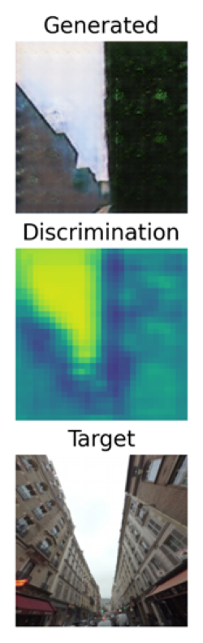|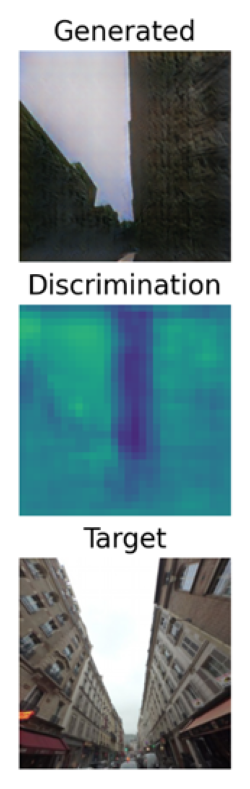|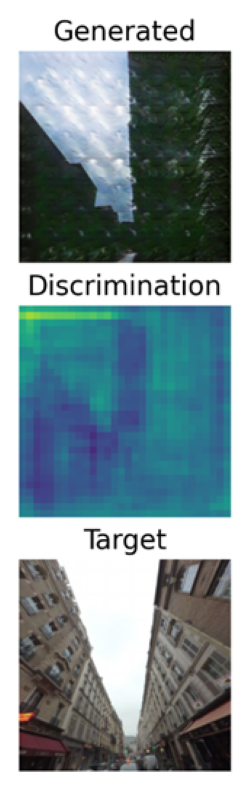|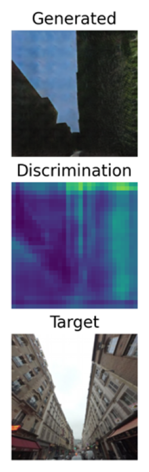|

<span id="_Toc148446802" class="anchor"></span>Figure A. Generated samples using the U-net, at epoch 1, 20, 60 and 140.

|epoch 1|epoch 20|epoch 100|epoch 246|
|:-------------------------------:|:-------------------------------:|:-------------------------------:|:-------------------------------:|
||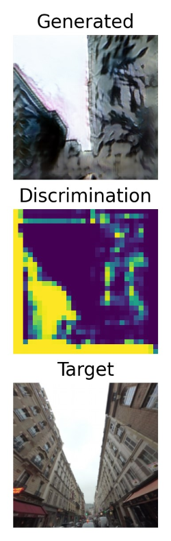|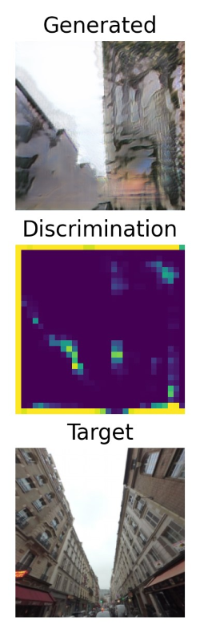|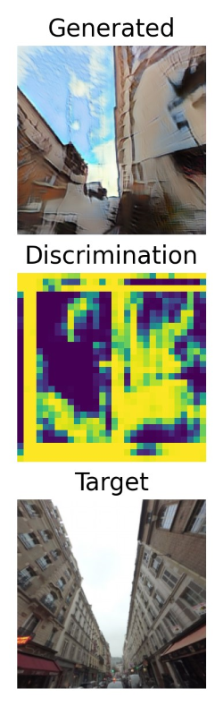|

<span id="_Toc148446803" class="anchor"></span>Figure A. Generated samples using the hinge loss, at epoch 1, 20, 100 and 246.

|epoch 1|epoch 20|epoch 40|epoch 107|
|:-------------------------------:|:-------------------------------:|:-------------------------------:|:-------------------------------:|
|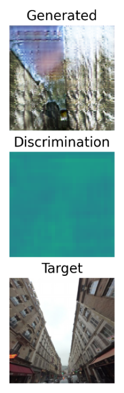|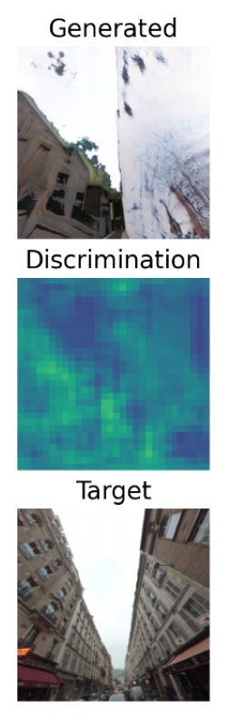|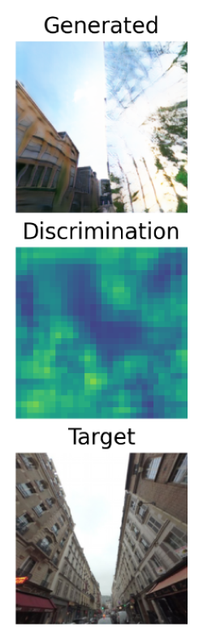|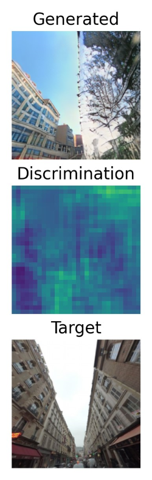|

<span id="_Toc148446804" class="anchor"></span>Figure A. Generated sample using a cycle adversarial loss (as in the CycleGAN), at epoch 1, 20, 40, 107.

[^1]: Test ran using a single 3-channels RGB image, on an intel i7-9750H and a NVIDIA GeForce GTX 1650M, the image data were already on the computing device, so the transfer time to GPU was not considered. The transformation parameters were yaw=30°, pitch=60°, fov=120°.

    CPU timings: 34.7 ms ± 3.1 ms per loop (mean ± std. dev. of 7 runs, 10 loops each)

    GPU timings: 7.05 ms ± 3 ms per loop (mean ± std. dev. of 7 runs, 10 loops each)

[^2]: Test ran on Cranfield’s supercomputer Crescent2, with HDD disks. The sample loading was on an intel Xeon CPU while the GAN model (SPADE + PatchGAN) was trained on a single NVIDIA V100. The same test with U-net was less conclusive as the network is so light that the average wait is always superior to the training time.

  [i]: #academic-integrity-declaration
  [ii]: #abstract
  [iii]: #acknowledgements
  [vi]: #list-of-figures
  [viii]: #list-of-abbreviations
  [9]: #introduction
  [1]: #motivation
  [2]: #problem-statement-and-research-objectives
  [3]: #contributions
  [10]: #related-work
  [12]: #data-acquisition
  [4]: #mapillary
  [13]: #blender
  [16]: #data-preprocessing-and-augmentation
  [5]: #perspective-transformation
  [20]: #resizing
  [6]: #remapping
  [21]: #horizontal-flip
  [7]: #random-transformation
  [8]: #computation-time-and-data-loading
  [22]: #transformation-bottleneck
  [11]: #order-matters
  [14]: #finding-the-optimal-batch-size
  [24]: #network-architecture
  [25]: #u-net-generator
  [26]: #spade-generator
  [27]: #patchgan-discriminator
  [28]: #cycle-gan
  [29]: #evaluation
  [15]: #loss-functions
  [30]: #segmentation-model
  [17]: #human-visualisation
  [31]: #training
  [18]: #data-splitting
  [32]: #optimizers
  [19]: #metrics
  [33]: #mixed-precision-training
  [34]: #model-saving
  [35]: #visualisation
  [23]: #ethics
  [36]: #gantt-chart
  [37]: #results-and-analysis
  [37]: #training-issues
  [38]: #with-a-u-net-generator
  [39]: #using-the-spade-generator
  [40]: #successful-tests
  [41]: #the-working-spade-generator
  [42]: #comparison-against-other-models
  [43]: #ablated-model
  [45]: #discussion
  [44]: #an-evaluated-dataset
  [46]: #better-3d-source
  [47]: #more-tests
  [48]: #conclusion
  [47]: #future-work
  [49]: #_Toc148436016
  [56]: #appendices
  [50]: #ethical-approval-letter
  [51]: #generated-samples
  [52]: #_Ref142895609
  [53]: #_Ref142935394
  [15]: #_Toc148446776
  [17]: #_Ref142407752
  [54]: #_Ref142410982
  [18]: #_Toc148446779
  [23]: #_Ref143264246
  [55]: #_Ref143374989
  [57]: #_Ref143434621
  [58]: #_Ref143434560
  [59]: #_Toc148446784
  [60]: #_Ref143496302
  [61]: #_Toc148446786
  [62]: #_Ref143499370
  [63]: #_Toc148446788
  [64]: #_Ref143528024
  [38]: #_Ref143508388
  [65]: #_Ref143508777
  [66]: #_Ref143510833
  [67]: #_Ref143510875
  [68]: #_Toc148446794
  [41]: #_Ref144146108
  [69]: #_Toc148446796
  [70]: #_Ref147434316
  [71]: #_Ref147435245
  [44]: #_Ref144210795
  [72]: #_Toc148446800
  [73]: #_Ref144213172
  [74]: #_Toc148446802
  [75]: #_Toc148446803
  [57]: #_Toc148446804
